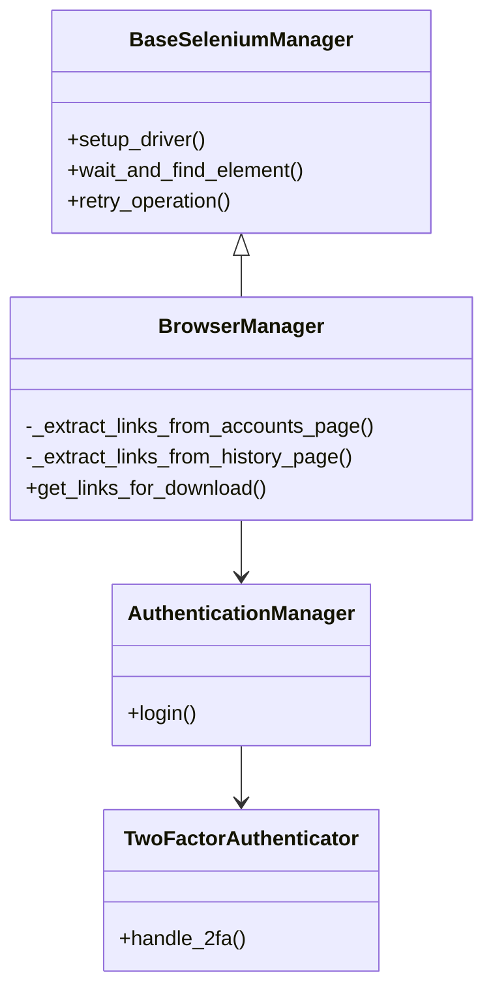
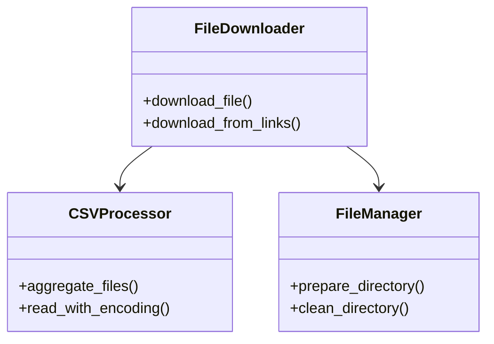

# MoneyForward Scraper リファクタリング計画

## 概要

MoneyForward Scraperのコードベースを改善し、より保守性が高く、テスト容易な構造にリファクタリングする計画です。

## 主要な改善点

1. コードの分割と責任範囲の明確化
2. エラーハンドリングの改善
3. 設定管理の改善
4. テスト容易性の向上
5. ロギングの改善

## 詳細な実装計画

### 1. コードの分割と責任範囲の明確化

#### BrowserManager クラスの改善



- Selenium関連の基本操作を基底クラスに移動
- ログイン処理を`AuthenticationManager`として分離
- 2段階認証の処理を`TwoFactorAuthenticator`として分離

#### FileDownloader クラスの改善



- ダウンロード処理とファイル集約処理を分離
- CSV処理を専用クラスに移動
- ファイル管理機能を分離

### 2. エラーハンドリングの改善

```python
class ScraperBaseError(Exception):
    """スクレイパーの基底例外クラス"""

class BrowserError(ScraperBaseError):
    """ブラウザ操作関連のエラー"""

class AuthenticationError(ScraperBaseError):
    """認証関連のエラー"""

class DownloadError(ScraperBaseError):
    """ファイルダウンロード関連のエラー"""

class CSVProcessingError(ScraperBaseError):
    """CSV処理関連のエラー"""
```

### 3. 設定管理の改善

```python
from pydantic import BaseSettings

class SeleniumSettings(BaseSettings):
    timeout: int
    retry_count: int
    chrome_driver_path: str
    chrome_binary_path: str

class AuthSettings(BaseSettings):
    email: str
    password: str
    two_factor_enabled: bool

class ScraperSettings(BaseSettings):
    selenium: SeleniumSettings
    auth: AuthSettings
    paths: PathSettings
```

### 4. テスト容易性の向上

```python
from typing import Protocol

class BrowserInterface(Protocol):
    def get_links_for_download(self, url: str) -> List[str]: ...
    
class DownloaderInterface(Protocol):
    def download_file(self, url: str, path: Path) -> Path: ...

class AuthenticatorInterface(Protocol):
    def login(self, email: str, password: str) -> None: ...
```

### 5. ロギングの改善

```python
import structlog

logger = structlog.get_logger()

# 使用例
logger.info(
    "download_started",
    url=download_url,
    target_path=str(output_path),
    attempt_number=attempt
)
```

## 実装優先順位

1. 基底クラスとインターフェースの作成
2. 認証処理の分離
3. ファイル処理の分離
4. エラーハンドリングの改善
5. 設定管理の改善
6. ロギングの改善

## 期待される効果

- コードの責任範囲が明確になる
- テストが書きやすくなる
- エラーハンドリングが一貫する
- 設定管理が容易になる
- 拡張性が向上する

## 注意点

- 既存の機能を壊さないよう、段階的にリファクタリングを進める
- 各段階でテストを作成し、リグレッションを防ぐ
- ドキュメントを更新し、変更内容を反映する
