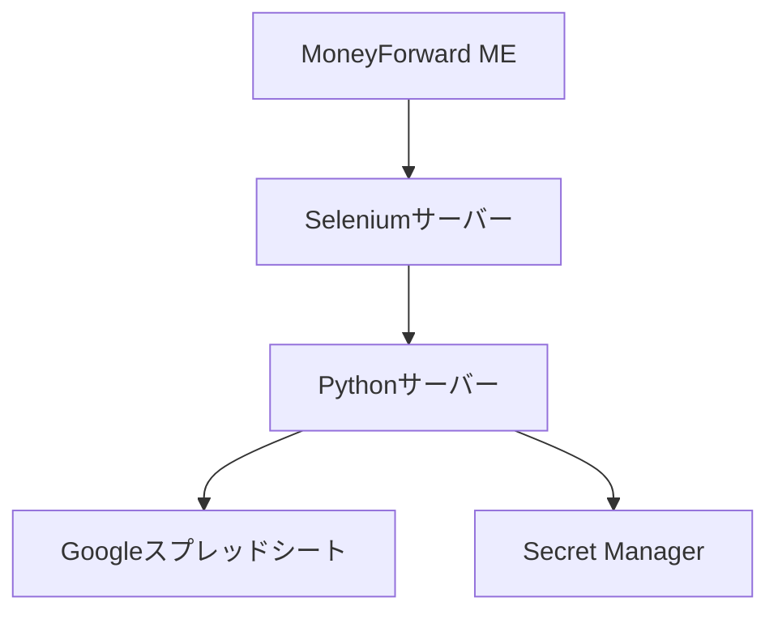
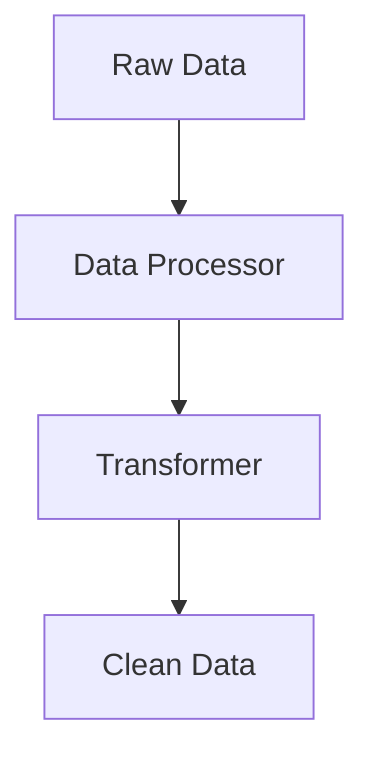

# システムパターン設計書

## アーキテクチャ概要



## コアコンポーネント

### 1. スクレイピングシステム


#### 実装パターン
- **Selenium WebDriver**による自動操作
- **リトライメカニズム**による安定性確保
- **ページオブジェクトパターン**でUI操作を抽象化

### 2. データ処理システム


#### 実装パターン
- **パイプライン処理**によるデータ変換
- **ルールエンジン**による柔軟な処理ルール
- **バリデーター**によるデータ品質保証

### 3. スプレッドシート同期システム


#### 実装パターン
- **バッチ処理**による一括更新
- **差分更新**による効率化
- **トランザクション**によるデータ整合性確保

## 設計原則

### 1. エラーハンドリング
```python
from typing import Union, TypeVar, Generic

T = TypeVar("T")
E = TypeVar("E")

class Result(Generic[T, E]):
    def __init__(self, ok: bool, value: Union[T, None] = None, error: Union[E, None] = None):
        self.ok = ok
        self.value = value
        self.error = error
```

- Result型による例外処理の統一
- リトライ機構の実装
- ログによる追跡可能性

### 2. 設定管理
```python
from pydantic import BaseSettings

class Settings(BaseSettings):
    selenium_timeout: int
    retry_count: int
    months_to_download: int
```

- Pydanticによる設定値の型安全性確保
- 環境変数との連携
- 設定の一元管理

### 3. データ抽象化
```python
from dataclasses import dataclass
from datetime import datetime

@dataclass(frozen=True)
class Transaction:
    date: datetime
    amount: int
    category: str
    memo: str
```

- Immutableなデータ構造
- 型安全性の確保
- ドメインモデルの明確化

## 技術的決定事項

### 1. 非同期処理
- スクレイピングの安定性向上
- バッチ処理の効率化
- エラーハンドリングの改善

### 2. キャッシュ戦略
- ダウンロードデータの一時保存
- 処理済みデータのキャッシュ
- 差分更新の実装

### 3. セキュリティ
- 認証情報のSecret Manager管理
- アクセストークンの安全な取り扱い
- エラーログからの機密情報除去

## モニタリングと運用

### 1. ログ管理
```yaml
logging:
  level: INFO
  format: '%(asctime)s - %(name)s - %(levelname)s - %(message)s'
  handlers:
    - console
    - file
```

### 2. エラー通知
- 重要エラーの即時通知
- リトライ状況の監視
- 定期実行状態の確認

### 3. パフォーマンス計測
- 実行時間の監視
- リソース使用状況の追跡
- ボトルネックの特定
