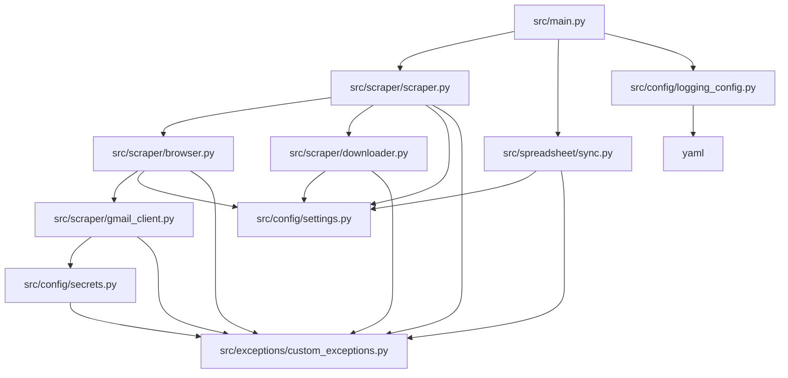
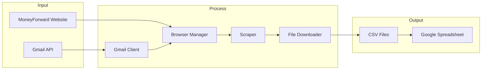

# アプリケーションアーキテクチャ

## モジュール依存関係

## データフロー

## コンポーネント説明

### メインコンポーネント
- **main.py**: アプリケーションのエントリーポイント。スクレイピング処理と同期処理を制御。
- **scraper.py**: MoneyForwardからのデータ取得を管理。
- **browser.py**: Seleniumを使用したブラウザ操作を制御。
- **downloader.py**: ファイルダウンロードを管理。
- **gmail_client.py**: Gmail APIを使用した2段階認証の処理。

### 設定・ユーティリティ
- **settings.py**: アプリケーション設定の管理。
- **secrets.py**: GCP Secret Managerを使用した機密情報の管理。
- **logging_config.py**: ロギング設定の管理。
- **custom_exceptions.py**: カスタム例外の定義。

### 同期コンポーネント
- **sync.py**: Google Spreadsheetとのデータ同期を管理。
